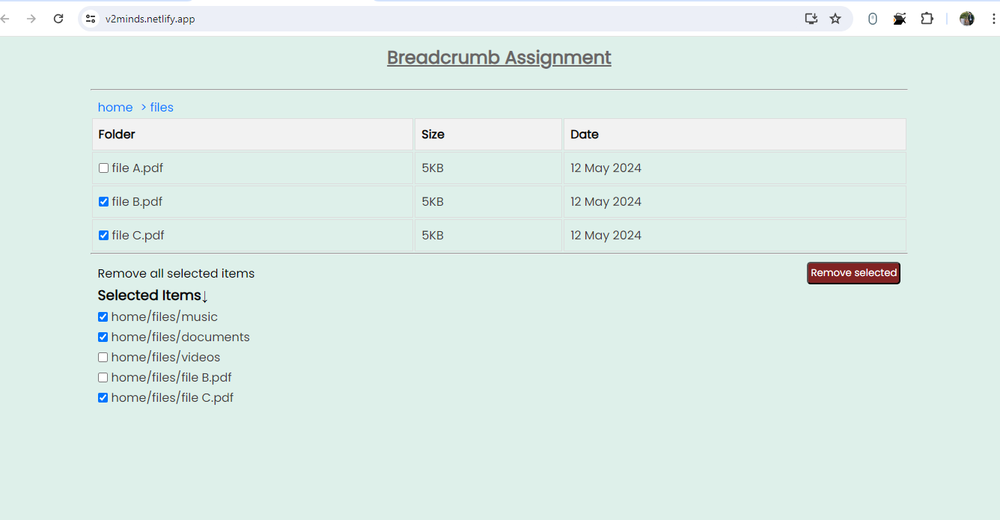

# Breadcrumb Assignment README

## Introduction
This project is a Breadcrumb assignment developed using React, HTML, CSS, and JavaScript. It provides a user-friendly interface for navigating through files and folders, displaying their hierarchy as breadcrumbs. The user can click on any part of the breadcrumb to filter other data and navigate to the selected item.

## Features
- Display files and folders on the UI.
- Navigate through files and folders using breadcrumbs.
- Click on any part of the breadcrumb to filter other data and navigate to the selected item.

## Getting Started
To run the project locally, follow these steps:
1. Clone the repository to your local machine.
2. Navigate to the project directory.
3. Install dependencies using npm install.
4. Start the development server.
5. Access the application in your web browser.

## Screenshot

## Site Link
The assignment is hosted on the following link: [V2Minds Website](https://v2minds.netlify.app/)

## Credits
- [React Documentation](https://reactjs.org/docs/getting-started.html)
- [MDN Web Docs](https://developer.mozilla.org/en-US/docs/Web)

## License
This project is licensed under the MIT License - see the [LICENSE](LICENSE) file for details.
